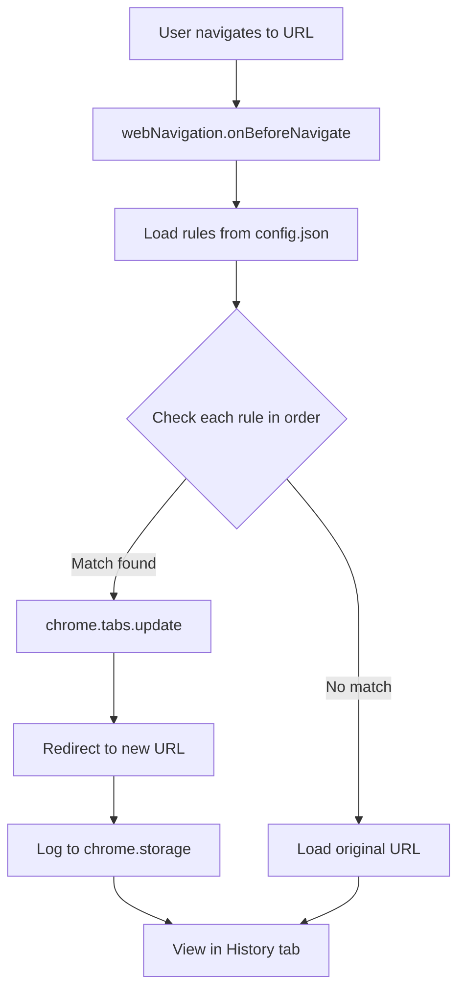

# URL Redirect Pro — Chrome Extension

Automatically redirects URLs based on rules defined in `config.json`.  
**Default use case**: `https://localhost:4502/*` → `http://localhost:4502/*`

---

## Installation

1. Open Chrome → go to `chrome://extensions/`
2. Enable **Developer mode** (top-right corner)
3. Click **"Load unpacked"** → select the `redirect-ext` folder
4. Extension appears in the toolbar

---

## Configuration Rules (`config.json`)

```json
{
  "rules": [
    {
      "id": "unique-rule-id",
      "description": "Rule description",
      "enabled": true,
      "matchType": "prefix",
      "from": "https://localhost:4502/",
      "to":   "http://localhost:4502/"
    }
  ]
}
```

### Match Types

| Type     | Description                              | Example `from`                    |
|----------|------------------------------------------|-----------------------------------|
| `prefix` | URL starts with `from` string           | `"https://localhost:4502/"`       |
| `exact`  | URL matches exactly                     | `"https://localhost:4502/login"`  |
| `regex`  | Uses Regular Expression                 | `"^https://localhost:(\\d+)/"`    |

### Example Rules

```json
{
  "rules": [
    {
      "id": "aem-author-4502",
      "description": "AEM Author: https → http",
      "enabled": true,
      "matchType": "prefix",
      "from": "https://localhost:4502/",
      "to":   "http://localhost:4502/"
    },
    {
      "id": "aem-publish-4503",
      "description": "AEM Publish: https → http",
      "enabled": true,
      "matchType": "prefix",
      "from": "https://localhost:4503/",
      "to":   "http://localhost:4503/"
    },
    {
      "id": "staging-to-local",
      "description": "Staging to local dev",
      "enabled": false,
      "matchType": "regex",
      "from": "^https://staging\\.example\\.com/(.*)",
      "to":   "http://localhost:3000/$1"
    }
  ]
}
```

> After editing `config.json`, click **"Reload"** in the popup to apply changes — no need to reload the extension.

---

## Features

- Redirects immediately when URL matches (before page loads)
- Fully configurable via `config.json` — no hard-coding
- 3 match types: `prefix`, `exact`, `regex`
- Enable/disable individual rules with `"enabled": true/false`
- Popup shows rule list and redirect history
- Reload button updates rules without restart
- Stores up to 100 recent redirects

---

## How It Works



---

## Input / Output

| Input | Output |
|-------|--------|
| `https://localhost:4502/content/site/page.html` | `http://localhost:4502/content/site/page.html` |
| `https://localhost:4503/libs/granite/core/content/login.html` | `http://localhost:4503/libs/granite/core/content/login.html` |
| `https://staging.example.com/products/123` (if enabled) | `http://localhost:3000/products/123` |
| `https://example.com/no-rule` | No redirect (loads normally) |

## License

MIT
